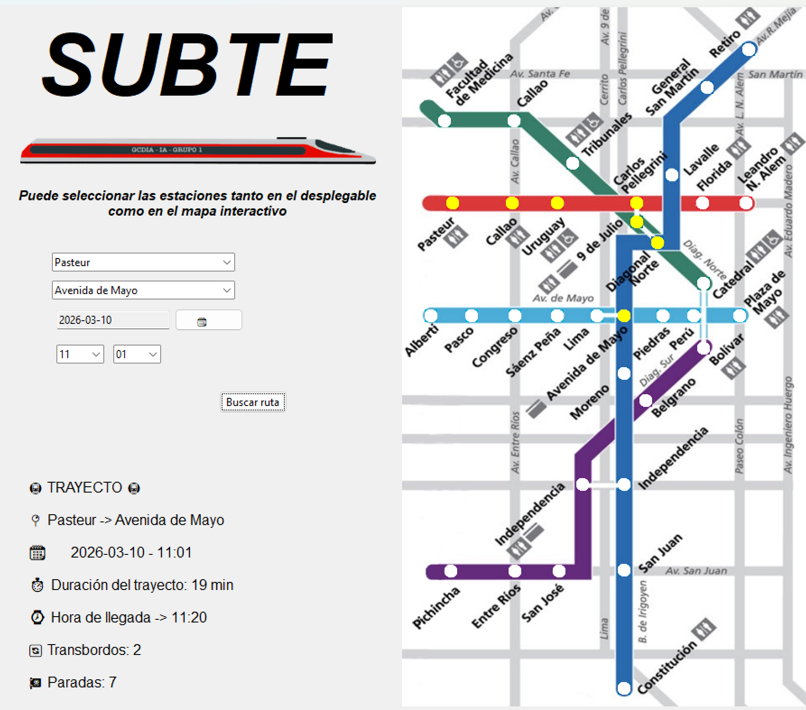

# Buenos Aires Subway Route Optimizer 🚇


Graphical application that computes optimal routes between selected Buenos Aires subway stations using the **A\*** search algorithm.

---

## Overview

This project is a graphical application for the Buenos Aires subway system (Subte) that calculates the optimal route between two selected stations using the **A\* (A-star) search algorithm**.

The application models a subset of the subway network as a graph where stations are nodes and connections are edges. The algorithm computes the most efficient path between two stations considering factors such as travel distance, transfers, schedules, and train frequency.

The project demonstrates the practical implementation of heuristic search algorithms applied to real-world transportation networks.

---

## Key Objective

The main objective of this project is to apply heuristic search techniques to a real-world transportation network and provide an interactive route planning tool for selected Buenos Aires subway stations.

---

## Features

### Route Optimization
- Computes the most efficient path between two stations.
- Considers travel distance, schedules, train frequency, and transfers.

### Graphical User Interface
- Built using **Tkinter**.
- Allows users to select origin and destination stations.
- Displays the calculated route visually.
- Highlights the stations included in the selected path.

### Travel Information
- Estimated travel duration
- Estimated arrival time
- Number of transfers required

---

## A* Algorithm

The application uses the **A\* (A-star)** search algorithm to compute the optimal route between selected subway stations.

The subway system is modeled as a weighted graph where:

- **Stations** are represented as nodes
- **Connections between stations** are represented as edges
- **Edge weights** reflect travel-related costs such as distance and transfers

The algorithm combines:

- the real cost of reaching a station
- a heuristic estimate of the remaining distance to the destination

This approach allows efficient and realistic route optimization within the subway network.

---

## Project Structure

```text
buenos-aires-subway-route-optimizer
│
├── src/
│   ├── app.py                     # Main application entry point
│   │
│   ├── data/                      # Subway data and interface helpers
│   │   ├── estaciones_buenos_aires_contildes.csv
│   │   ├── elementos_apoyo_interfaz.py
│   │   └── __init__.py
│   │
│   ├── logic/                     # Graph construction and A* algorithm
│   │   ├── codigo_aestrella.py
│   │   ├── grafo.py
│   │   └── __init__.py
│
├── assets/                        # Images and graphical resources
│   ├── icons/
│   │   └── logo_subte.ico
│   │
│   └── images/
│       ├── fondo.jpg
│       ├── logo_subte.png
│       ├── train_no_background.png
│       └── interfaz.png
│
├── docs/
│   └── Memoria.pdf                # Project report
│
├── README.md
├── requirements.txt
└── LICENSE
```

---

## Technologies Used

- Python
- NetworkX
- Pandas
- NumPy
- Matplotlib
- Tkinter
- Datetime
- CustomTkinter
- Pillow
- tkcalendar

  
---

## Installation

Install the required dependencies:

```bash
pip install -r requirements.txt

```

---


## Running the Application

From the root of the repository run:

```bash
python src/app.py
```

---

## Example Usage
1. Launch the application.
2. Select the origin station.
3. Select the destination station.
4. Choose the desired departure time.
5. The application computes the optimal route using the A* algorithm.
6. The interface displays the optimal route, travel time, and number of transfers.

--- 

## Screenshots

Main application interface:



--- 

## Documentation

> 📄 **Project Report:** [View the full project report (PDF)](docs/Memoria.pdf)

---

## Authors

- Diego J. García Callejas
- Pablo de Tarso Pedraz García
- Manuel Arce Losada
- Pedro Álvaro Martínez Gutiérrez
- Mario Martín Muñoz
- Héctor Fernández Cano 
